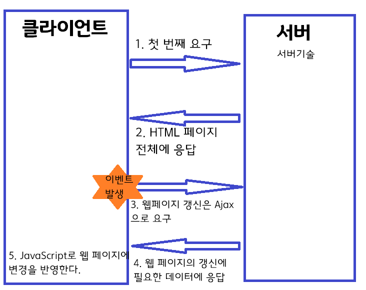

#1 소개

## 1.1 javaScript란?
- Netscape Communication이 개발한 브라우저 전용의 스크립트 언어
- Java와 javaScript는 언어 사양이 닮긴 했으나 전혀 다른 별개의 언어이며 서로 호환성도 없다.
- Google Chrome, Firefox, Safari, Microsoft Edge 등 대부분의 주요 브라우저에 탑재

### 1.1.1 JavaScript의 역사
1990년대 후반 JavaScript의 전성기 였으나 다음과 같은 문제점이 생겼다.
- **과열 현상** : JavaScript를 과도하게 치장하여 사용하기에도 나쁘고 모양새도 안 좋은 웹 페이지가 대량으로 양산
	- 이로인해 '모양새가 좋지 않은 웹 페이지를 작성하기 위한 언어', '프로그래밍 초보자나 사용하는 저속한 언어'라는 나쁜 이미지 형성
- **크로스 브라우징 문제** : 각각의 브라우저 벤터가 JavaScript의 기본장착을 확장하여 브라우저 간의 사양 차이가 커짐(각각 브라우저에 대응하는 코드 작성)
- **시큐리티 홀(security hole:안전 취약)** : 보안이 취약하다는 문제가 발생되어 javaScript 이미지에 악영향

### 1.1.2 JavaScript 부활 - Ajax, 그리고 HTML5의 시대 
다음과 같은 배경을 근간으로 JavaScirpt가 부활하게 되었다.

- 2005년 2월, Ajax의 등장으로 html, css, javascript만으로 리치 콘텐츠작성이 가능
 
	- Ajax(Asynchronous Javascript + XML)란, 한마디로 브라우저상테어 데스크톱 애플리케이션과 같은 웹 페이지를 작성하기 위한 기술
	- HTML이나 CSS의 표현력을 곁에서 보충만 하는 간이 언어 → Ajax 기술을 지탱하는 핵심
	- 함수를 조합하는 방식의 간이적인 작성 방식만이 아닌, 대규모 개발에도 견뎌낼 수 있는 객체지향적인 작성법 요구

- 브라우저 벤더에 의한 기능 확장 경쟁도 사그라들어 호환성 문제도 줄어들었다.

- ECMA에서 표준화를 진행하여 언어로서의 완성도를 높임(표준화된 javaScript를 ECMAscript라고 부름)

- 2000년대 후반 HTML5 등장
	- JavaScript API를 강화
	| 기능  | 개요 |
|--------|--------|
|   Geolocation API   |   사용자의 지리적인 위치를 취득한다      |
|   Canvas  |   JavaScript로 동적인 이미지를 그린다      |
|   File API   |   로컬의 파일 시스템을 읽고 쓴다      |
|   Web Storage   |   로컬 데이터를 저장하기 위한 스토리지     |
|   Indexed Database   |   키/값의 세트로 JavaScript의 객체 관리      |
|   Web Workers   |   백그라운드에서 JavaScript를 병령 실행      |
|   Web sockets   |   클라이언트-서버 간의 쌍방향 통신을 실시하기 위한 API      |

- 스마트폰/태플린 PC의 보급에 의해 RIA기술(Flash/Silverlight)의 쇠퇴

- SPA(Single Page Application)의 유행
	- SPA :  이름 그대로 단일 페이지로 구성된 앱 애플리케이션을 말한다. 처음 한번의 액세스로 우선 웹 페이지 전체를 취득하는데, 이후의 웹 페이지 갱신은 기본적으로 JavaScirpt로 실시한다. 데이터의 취득/갱신 등 자바스크립트 만으로 처리를 못하는 경우는 Ajax의 비동기 통신을 이용하여 구현한다. 
	
    
### 1.1.3 나쁜 이미지에 대한 오해

- 초급자용으로 간단하고 쉽기만 한 언어다 → JavaScript는 Java나 C# 등의 프로그래밍 언어왇 동일하게 훌륭한 객체지향 언어다.
- 시큐리티 홀이 많다 → JavaScript의 문제가 아닌 브라우저의 문제다. 요즘에는 브라우저 벤더의 시큐리티 의식이 높아져 JavaScript에 관한 시큐리티 홀 문제는 거의 없어진 상황이다.
- 크로스 브라우저 문제가 있어 개발 생산성이 떨어진다 → 브라우저의 문제다. 그리고 표준화의 흐름 하에서 호환성 문제는 경감되고 있는 추세다.

### 1.1.4 언어로서의 네 가지 특징

1. 스크립트 언어다.
	- 스크립트 언어 : 간편한 코딩을 목적으로 만든 프로그래밍 언어
2. 인터프리터 언어다.
	- 인터프리터 언어 : 프로그램을 처음부터 일일이 상세하게 해석해 컴퓨터가 이해할 수 있는 형식으로 번역하면서 실행해나가는 언어
	- 컴파일 언어에 비해 동작이 느리다. 대신 프로그램을 실행하기 전 특별한 절차가 필요없고, 코드를 작성하여 바로 그 자리에서 손쉽게 실행할 수 있다.
3. 여러 환경에서 이용 가능하다.
	- 처음엔 브라우저상에서 동작하는 것을 고려해 만들었찌만, 현재는 브라우저 이외에도 여러 부문에서 사용된다.
	> JavaScript(파생) 언어의 주요 실행 환경
	> 1. Node.Js : 서버 측 용도를 중심으로 한 JavaScipt 실행 환경
	> 2. Window Script Host : Windows 환경의 스크립트 실행 환경
	> 3. Java Platform, Standard Edition : Java 언어의 실행 환경
	> 4. Android / IOS(WebView) : 웹 페이지를 표시하기 위한 내장형 브라우저

4. 몇 개의 부분으로 구성되어 있다.
	- 자바스크립트는 엄밀하게 몇 개의 부분으로 분류할 수 있다.
	> Core JavaScript - 환경에 의존하지 않는 JavaScript (표준적인 기능을 제공하는 부분)
	> DOM(document Object Model) - JavaScript뿐만 아니라 다른 프로그래밍 언어에서도 도큐먼트를 동적으로 조작할 수 있는 범용적인 사양.
	> 브라우저 객체 - 브라우저상에서의 조작을 JavaScript로부터 실행하기 위한 기능

## 1.2 ECMAscript 2015란? (ECMAScript 6)

표준화 단체 ECMA International이 표준화한 JavaScript다. (표준화된 자바스크립트)
ES2015에서 새롭게 제공되는 사양은 다음과 같다

- class 명령의 도입으로 Java/C#과 같은 클래스 정의가 가능해졌다.
- Import/export 명령으로 코드의 모듈화 지원
- 

## 1.3 브라우저의 개발자 도구